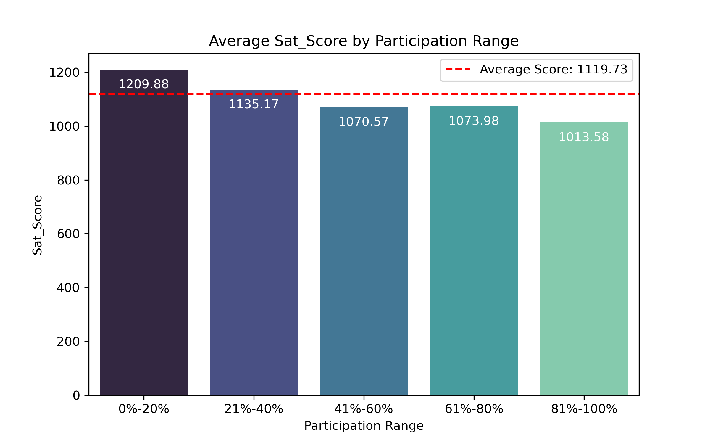
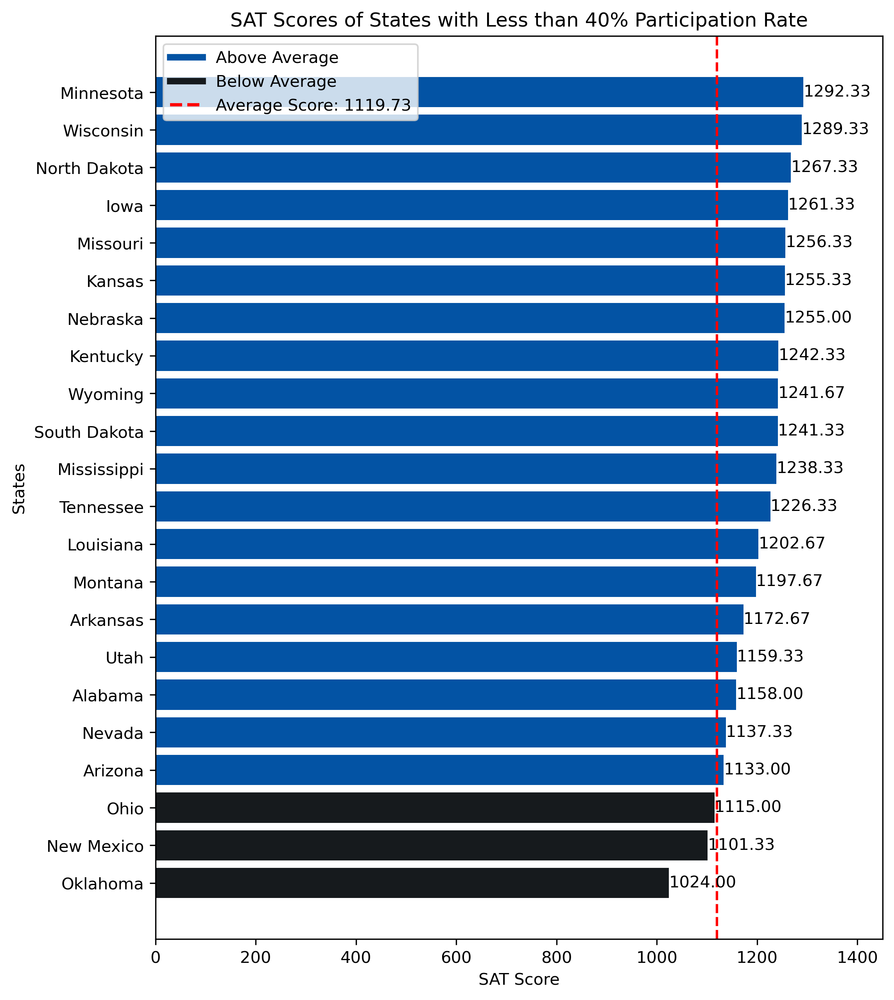

### Problem Statement

Between 2017 and 2019, the overall average SAT scores showed a downward trend, with varying participation rates among states in the United States. This study aims to analyze the participation rate ranges that are likely to yield scores higher than the overall average in order to understand the relationship between participation rates and average SAT scores in each state.

---

### Datasets

The dataset contains detailed information on SAT scores, structured as follows:

- **State** : The name of the U.S. state where the SAT scores were recorded.
- **Participation** : The percentage of eligible students in each state who participated in the SAT exam.
- **Points in Each Session** : The scores achieved by students in individual SAT sections (e.g., Evidence-Based Reading and Writing, Math).
- **Total Points** : The cumulative score of all sections for each student, representing their overall performance on the SAT.

* [`sat_2017.csv`](./data/sat_2017.csv): 2017 SAT Scores by State ([source](https://blog.collegevine.com/here-are-the-average-sat-scores-by-state/))
* [`sat_2018.csv`](./data/sat_2018.csv): 2018 SAT Scores by State ([source](https://blog.collegevine.com/here-are-the-average-sat-scores-by-state/))
* [`sat_2019.csv`](./data/sat_2019.csv): 2019 SAT Scores by State ([source](https://blog.prepscholar.com/average-sat-scores-by-state-most-recent))

---

### Methodology

This study employs the following methodology to analyze the data using jupyter notebook [`Code.ipynb`](.Code.ipynb):
- **Data Cleaning**: Handle missing values and ensure consistency across datasets.
- **Exploratory Data Analysis (EDA)**: Visualize participation rates and SAT scores to identify trends.

---

### Findings 

The analysis revealed that states with a participation rate of less than 40% tend to have above-average SAT scores. Key findings include:
- Out of 22 states with participation rates of less than 40%, 19 states have above-average SAT scores.
- Three states with below-average SAT scores are Ohio, New Mexico, and Oklahoma.
- All 22 states have an ACT participation rate of at least 65%.

---

### Visualizations
To support the findings, the following figures are included:

1. Average SAT Score by Participation Rate Range
   

This figure illustrates the average SAT scores categorized by different participation rate ranges.

2. SAT Scores of States with Less than 40% Participation Rate

This figure displays the SAT scores for states with participation rates below 40%, highlighting those with above and below-average scores.

---

### Conclusion

This analysis provides insights into the relationship between SAT participation rates and average scores. The findings support the hypothesis that lower participation rates are associated with higher average scores in some states. The reasons why states with lower participation rates may achieve higher SAT scores could include:
- Exclusion of many students, with only high-achieving students taking the SAT.
- Most students prioritize the ACT, leading those who take the SAT to be well-prepared, motivated, and to put in more effort.
- Wealthier families may hire tutors for their children, while less affluent families may not have access to such resources.

---

### Futher Work

Further investigations will focus on answering the questions raised in the conclusion to explore the underlying factors affecting SAT participation and scores.
